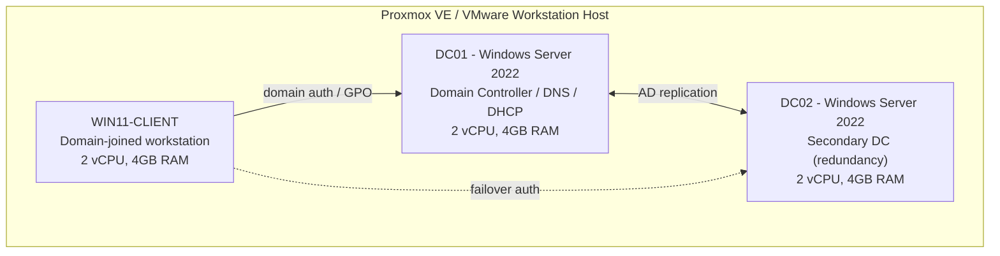

# Active Directory Enterprise Lab

[](https://github.com/EbubeNnaemeka/active-directory-lab/actions/workflows/ci.yml)

**Status:** Scripts and playbook linted and checked in CI; the 500-user dataset is generated and validated. Deployment to Windows Server VMs is next.

A self-built, multi-VM Active Directory environment simulating a mid-size enterprise domain: forest/domain setup, DNS, DHCP, OUs, bulk user provisioning, and Group Policy — built to demonstrate real sysadmin skills, not just certification study.

## Architecture



## What this lab includes

- **Forest/domain**: `corp.lab` — single forest, single domain, two domain controllers for redundancy
- **DNS**: AD-integrated zone, forward/reverse lookup configured
- **DHCP**: scope configured for the client subnet, reservations for infrastructure IPs
- **Organizational Units**: modeled after a real company structure (IT, Finance, HR, Sales, Executives — each with its own OU and delegated permissions)
- **Bulk user provisioning**: 500 realistic users generated by [`New-SampleUserCsv.ps1`](scripts/New-SampleUserCsv.ps1) (seeded, so the lab rebuilds identically) and created by [`New-BulkADUsers.ps1`](scripts/New-BulkADUsers.ps1)
- **Group Policy Objects**:
  - Password/lockout policy (enterprise baseline)
  - Mapped network drives per department OU
  - Desktop restriction policy for a "Sales" test OU
  - Software restriction policy example

## Prerequisites

| Requirement | Details |
|---|---|
| Hypervisor | Proxmox VE (free) or VMware Workstation Player (free, personal use) |
| ISOs | Windows Server 2022 Evaluation (180-day, free from Microsoft Evaluation Center), Windows 11 Evaluation |
| Host resources | 16–32GB RAM, 4+ CPU cores, 200GB free storage |
| Networking | Internal/host-only vSwitch so the lab never touches your real LAN |

## Build order

1. **Provision VMs** — see [`docs/01-vm-provisioning.md`](docs/01-vm-provisioning.md) for exact specs per VM.
2. **Promote DC01** — run [`scripts/New-Forest.ps1`](scripts/New-Forest.ps1) to stand up the forest, DNS, and DHCP role.
3. **Join DC02** — run [`scripts/Join-SecondDC.ps1`](scripts/Join-SecondDC.ps1) for redundancy.
4. **Build OU structure** — run [`scripts/New-OUStructure.ps1`](scripts/New-OUStructure.ps1).
5. **Bulk-provision users** — run [`scripts/New-BulkADUsers.ps1`](scripts/New-BulkADUsers.ps1) with [`data/users-500.csv`](data/users-500.csv) (regenerate with `New-SampleUserCsv.ps1 -Count <n>`). It takes the initial password as a SecureString and supports `-WhatIf`.
6. **Apply GPOs** — import the exported GPO backups in [`gpo/`](gpo/) via `Import-GPO`, or build from [`docs/02-gpo-design.md`](docs/02-gpo-design.md).
7. **Join a client** — join `WIN11-CLIENT` to `corp.lab` and confirm GPOs apply (`gpresult /r`).

Day-2 configuration is also automatable via the Ansible playbook in [`ansible/`](ansible/) if you'd rather not run each PowerShell script by hand.

## Resume bullet (use once you have completed and verified the lab)

> Deployed a two-DC Active Directory forest (Windows Server 2022) with redundant DNS, DHCP, 4 Group Policy Objects, and 500 users provisioned from CSV across 5 departmental OUs using idempotent PowerShell and Ansible.

## Repo contents

```
├── README.md
├── docs/
│   ├── 01-vm-provisioning.md
│   └── 02-gpo-design.md
├── scripts/
│   ├── New-Forest.ps1
│   ├── Join-SecondDC.ps1
│   ├── New-OUStructure.ps1
│   ├── New-SampleUserCsv.ps1
│   └── New-BulkADUsers.ps1
├── data/
│   └── users-500.csv
├── ansible/
│   ├── inventory.ini
│   ├── site.yml
│   └── group_vars/all.yml.example
└── gpo/
    └── README.md
```

---

Part of my homelab portfolio: **[ebube-nnaemeka.pages.dev](https://ebube-nnaemeka.pages.dev)** · [All projects](https://github.com/EbubeNnaemeka)
